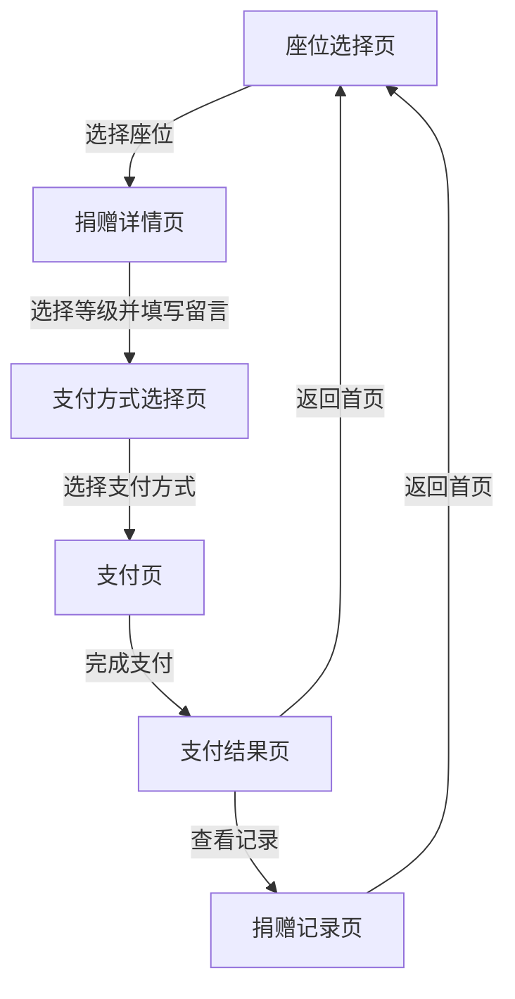
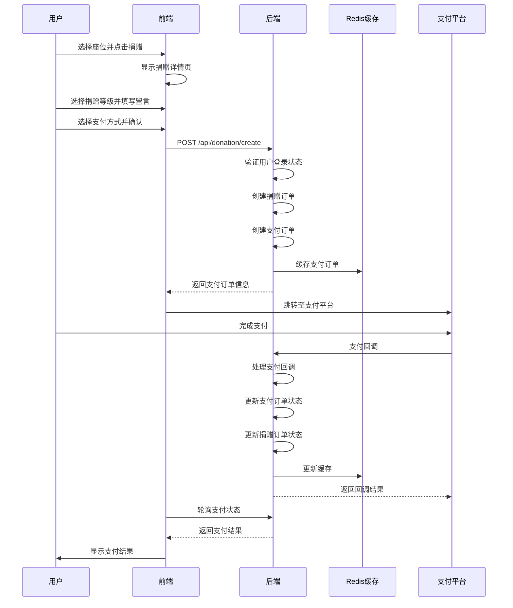
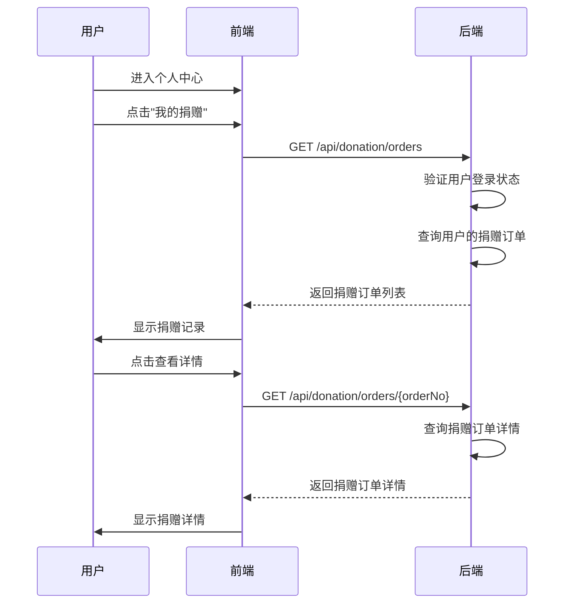

# 捐赠与支付交互设计文档

## 1. 设计目标

- **简洁直观**：捐赠流程简单明了，减少用户操作步骤
- **响应迅速**：页面加载和操作响应及时，提供良好的用户体验
- **安全可靠**：支付过程安全，数据传输加密
- **反馈明确**：操作结果及时反馈，引导用户正确操作
- **兼容多端**：支持PC端和移动端，适配不同屏幕尺寸

## 2. 页面流程

### 2.1 捐赠流程页面

1. **座位选择页**：展示VR教室座位布局，用户选择要捐赠的座位
2. **捐赠详情页**：显示选中座位信息，用户选择捐赠等级，填写留言
3. **支付方式选择页**：用户选择支付方式（微信支付、支付宝等）
4. **支付页**：跳转至支付平台或调用支付SDK
5. **支付结果页**：显示支付结果（成功/失败）
6. **捐赠记录页**：展示用户的捐赠历史记录

### 2.2 页面流程图

## 3. 用户操作流程

### 3.1 捐赠操作流程

1. **用户进入VR教室**：用户登录系统后，进入VR教室页面
2. **选择座位**：在座位选择页中，用户浏览座位布局，选择一个要捐赠的座位
3. **查看座位详情**：系统显示选中座位的详细信息，包括座位编号、位置等
4. **选择捐赠等级**：用户从预设的捐赠等级中选择一个，系统显示对应等级的捐赠金额
5. **填写留言**：用户可选择填写捐赠留言，如祝福语、个人信息等
6. **选择支付方式**：用户选择支付方式，如微信支付、支付宝等
7. **确认捐赠**：用户确认捐赠信息，点击"确认捐赠"按钮
8. **完成支付**：系统跳转至支付平台或调用支付SDK，用户完成支付操作
9. **查看支付结果**：支付完成后，系统显示支付结果页面，告知用户支付是否成功
10. **查看捐赠记录**：用户可选择查看自己的捐赠记录，了解捐赠历史

### 3.2 查看捐赠记录流程

1. **用户进入个人中心**：用户登录系统后，进入个人中心页面
2. **点击"我的捐赠"**：在个人中心页面中，用户点击"我的捐赠"选项
3. **查看捐赠记录**：系统显示用户的捐赠历史记录，包括捐赠日期、金额、座位信息等
4. **查看详情**：用户可点击单个捐赠记录，查看详细信息

### 3.3 取消捐赠流程

1. **用户进入捐赠记录**：用户登录系统后，进入捐赠记录页面
2. **选择待支付的捐赠**：用户找到状态为"待支付"的捐赠记录
3. **点击"取消捐赠"**：用户点击"取消捐赠"按钮
4. **确认取消**：系统弹出确认对话框，用户确认取消操作
5. **查看结果**：系统更新捐赠记录状态，显示取消成功

## 4. 前端与后端交互

### 4.1 核心API接口

| 接口路径 | 方法 | 功能描述 | 请求参数 | 成功响应 | 失败响应 |
|---------|------|----------|----------|----------|----------|
| /api/donation/create | POST | 创建捐赠订单和支付订单 | seatId: Integer tierId: Integer message: String paymentMethod: String | `{"code": 200, "msg": "success", "data": {支付订单信息}}` | `{"code": 401, "msg": "用户未登录"} {"code": 400, "msg": "参数错误"}` |
| /api/donation/orders | GET | 获取用户的捐赠订单列表 | page: Integer (可选) | `{"code": 200, "msg": "success", "data": [捐赠订单列表]}` | `{"code": 401, "msg": "用户未登录"}` |
| /api/donation/orders/{orderNo} | GET | 获取捐赠订单详情 | orderNo: String (路径参数) | `{"code": 200, "msg": "success", "data": {捐赠订单详情}}` | `{"code": 404, "msg": "订单不存在"}` |
| /api/donation/orders/{id}/cancel | POST | 取消捐赠订单 | id: Integer (路径参数) | `{"code": 200, "msg": "success"}` | `{"code": 400, "msg": "取消订单失败"}` |
| /api/payment/orders | GET | 获取用户的支付订单列表 | page: Integer (可选) | `{"code": 200, "msg": "success", "data": [支付订单列表]}` | `{"code": 401, "msg": "用户未登录"}` |
| /api/payment/orders/{orderNo} | GET | 获取支付订单详情 | orderNo: String (路径参数) | `{"code": 200, "msg": "success", "data": {支付订单详情}}` | `{"code": 404, "msg": "订单不存在"}` |
| /api/payment/orders/{id}/cancel | POST | 取消支付订单 | id: Integer (路径参数) | `{"code": 200, "msg": "success"}` | `{"code": 400, "msg": "取消订单失败"}` |

### 4.2 交互时序图

#### 4.2.1 创建捐赠订单时序图

#### 4.2.2 查看捐赠记录时序图

## 5. 界面设计

### 5.1 座位选择页

- **布局**：网格布局展示VR教室座位，每个座位显示座位编号
- **交互**：
  - 鼠标悬停时，座位高亮显示，显示座位详情
  - 点击座位时，选中座位并进入捐赠详情页
  - 支持座位筛选和搜索功能
- **视觉**：
  - 已捐赠的座位显示特殊标记（如金色边框）
  - 不同区域的座位使用不同颜色区分
  - 座位大小适中，便于点击

### 5.2 捐赠详情页

- **布局**：
  - 顶部显示选中座位信息（编号、位置等）
  - 中部显示捐赠等级选择（卡片式布局）
  - 底部显示留言输入框和操作按钮
- **交互**：
  - 点击捐赠等级卡片时，选中该等级并显示对应金额
  - 留言输入框支持多行输入
  - 点击"下一步"按钮进入支付方式选择页
- **视觉**：
  - 捐赠等级卡片使用不同颜色区分，金额越大颜色越醒目
  - 选中的等级卡片显示选中状态（如边框高亮）
  - 按钮样式统一，突出主要操作

### 5.3 支付方式选择页

- **布局**：列表布局展示可用的支付方式
- **交互**：
  - 点击支付方式选项时，选中该方式
  - 点击"确认支付"按钮进入支付页
- **视觉**：
  - 每个支付方式显示对应的图标和名称
  - 选中的支付方式显示选中状态
  - 按钮样式统一，突出主要操作

### 5.4 支付结果页

- **布局**：
  - 顶部显示支付结果图标（成功/失败）
  - 中部显示支付结果提示信息
  - 底部显示操作按钮（查看记录、返回首页）
- **交互**：
  - 点击"查看记录"按钮进入捐赠记录页
  - 点击"返回首页"按钮返回VR教室首页
- **视觉**：
  - 支付成功时使用绿色图标和文字
  - 支付失败时使用红色图标和文字
  - 按钮样式统一，突出主要操作

### 5.5 捐赠记录页

- **布局**：列表布局展示捐赠记录，每条记录显示关键信息
- **交互**：
  - 点击记录条目时，显示详细信息
  - 支持按时间、金额排序
  - 支持筛选功能
- **视觉**：
  - 每条记录显示捐赠日期、金额、座位信息、状态
  - 不同状态的记录使用不同颜色区分
  - 响应式设计，适配不同屏幕尺寸

## 6. 响应式设计

### 6.1 设计原则

- **移动优先**：优先考虑移动端用户体验，再扩展到PC端
- **断点设计**：设置合理的断点，适配不同屏幕尺寸
- **内容重排**：在小屏幕设备上，合理重排内容，确保可读性
- **触摸优化**：在移动端，增大点击区域，优化触摸交互

### 6.2 断点设置

| 设备类型 | 屏幕宽度 | 布局调整 |
|---------|----------|----------|
| 移动端 | < 768px | 单列布局，简化导航，增大点击区域 |
| 平板 | 768px - 1024px | 双列布局，优化内容展示 |
| PC端 | > 1024px | 多列布局，充分利用屏幕空间 |

### 6.3 适配策略

- **座位选择页**：
  - 移动端：简化座位布局，使用网格或列表展示
  - PC端：完整展示座位布局，支持鼠标悬停效果

- **捐赠详情页**：
  - 移动端：单列布局，捐赠等级垂直排列
  - PC端：双列布局，捐赠等级卡片式排列

- **支付方式选择页**：
  - 移动端：单列列表，每个支付方式占满宽度
  - PC端：多列布局，支付方式并排显示

- **捐赠记录页**：
  - 移动端：单列列表，简化信息展示
  - PC端：多列布局，完整显示记录信息

## 7. 交互优化

### 7.1 加载状态优化

- **骨架屏**：在数据加载过程中，显示骨架屏，减少用户等待感
- **加载动画**：使用简洁的加载动画，提示用户操作正在进行
- **进度条**：在支付过程中，显示支付进度条，增强用户信心

### 7.2 错误处理优化

- **友好提示**：使用友好的错误提示信息，避免技术术语
- **错误定位**：明确指出错误位置，引导用户正确操作
- **重试机制**：在网络错误等情况下，提供重试按钮
- **兜底方案**：当主要功能失败时，提供备选方案

### 7.3 反馈机制优化

- **即时反馈**：用户操作后，立即给出视觉或听觉反馈
- **状态提示**：使用Toast、Banner等组件提示操作结果
- **引导式反馈**：在关键步骤，提供引导式提示，帮助用户完成操作

### 7.4 性能优化

- **懒加载**：图片和非关键资源使用懒加载
- **缓存策略**：合理使用浏览器缓存，减少重复请求
- **请求合并**：合并多个API请求，减少网络开销
- **预加载**：在用户可能的操作路径上，预加载相关资源

## 8. 无障碍设计

- **键盘导航**：支持键盘导航，确保所有功能可通过键盘访问
- **屏幕阅读器**：优化页面结构和标签，确保屏幕阅读器可正确解读
- **颜色对比度**：确保文本与背景的颜色对比度符合标准，便于阅读
- **字体大小**：支持用户调整字体大小，适应不同视力需求
- **操作提示**：为所有交互元素提供清晰的操作提示

## 9. 安全考虑

- **数据加密**：所有敏感数据（如支付信息）传输使用HTTPS加密
- **防止CSRF**：实现CSRF防护，防止跨站请求伪造
- **输入验证**：前端对用户输入进行验证，防止恶意输入
- **敏感信息保护**：不在前端存储敏感信息，如用户密码、支付凭证等
- **错误信息处理**：不在前端显示详细的错误信息，避免信息泄露

## 10. 测试策略

### 10.1 用户体验测试

- **原型测试**：使用低保真或高保真原型，测试用户操作流程
- **A/B测试**：对不同的设计方案进行A/B测试，选择最优方案
- **用户访谈**：与用户进行访谈，了解用户对捐赠流程的反馈
- **可用性测试**：测试用户完成捐赠任务的成功率和时间

### 10.2 功能测试

- **单元测试**：测试前端组件和后端API的功能
- **集成测试**：测试前端与后端的集成功能
- **端到端测试**：测试完整的捐赠流程
- **兼容性测试**：测试在不同浏览器和设备上的兼容性

### 10.3 性能测试

- **加载速度测试**：测试页面加载速度
- **响应时间测试**：测试API响应时间
- **并发测试**：测试系统在高并发情况下的性能
- **稳定性测试**：测试系统在长时间运行下的稳定性

## 11. 总结

捐赠与支付交互设计是VR教室项目中的重要组成部分，通过合理的页面流程、用户操作流程和界面设计，为用户提供了简洁、直观、安全的捐赠体验。同时，通过响应式设计和交互优化，确保了在不同设备上的良好体验。

在实现过程中，需要关注性能优化、安全考虑和无障碍设计，确保系统的稳定性、安全性和可用性。通过用户体验测试和功能测试，不断优化设计方案，提高用户满意度。